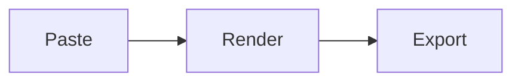

# Demo GIF Guide

The README references `docs/demo.gif` but the asset isn't recorded yet. This guide is a quick recipe for the maintainer to produce one.

## Goal

A short (≤ 8 second), ≤ 4 MB GIF that shows the **paste → render → export** loop in one continuous take. This is the single most leverage-positive asset for stars and Product Hunt.

## What to record (storyboard)

1. App opens (Sepia or Dark theme — looks better than Light on neutral backgrounds).
2. `Cmd/Ctrl + V` paste of a markdown sample with: a heading, a code block, a Mermaid diagram, a table.
3. Preview updates instantly on the right pane.
4. Open the export dropdown → click PDF (or PNG).
5. The fly-to-dock download animation finishes.

Total: 4–6 actions. Avoid mouse hover scrubbing — looks indecisive on a loop.

## Sample input (paste this verbatim)

````markdown
# Markie demo

A `markdown-it` based renderer with **Mermaid**, syntax highlighting, and one-click export.

| Format | Shortcut |
| --- | --- |
| PDF | `Cmd/Ctrl + P` |
| PNG | `Cmd/Ctrl + Shift + P` |



```ts
function render(input: string): string {
  return md.render(input);
}
```
````

## Recording (macOS)

1. **Capture** with the built-in `Cmd + Shift + 5` → "Record Selected Portion" → save as `.mov`.
2. **Convert** to GIF with `ffmpeg`:
   ```bash
   ffmpeg -i demo.mov -vf "fps=18,scale=1280:-1:flags=lanczos,palettegen" /tmp/palette.png
   ffmpeg -i demo.mov -i /tmp/palette.png -lavfi "fps=18,scale=1280:-1:flags=lanczos [x]; [x][1:v] paletteuse" docs/demo.gif
   ```
   Aim for ≤ 4 MB. Drop fps to 15 or width to 1024 if oversized.
3. **Optimize** further (optional):
   ```bash
   gifsicle -O3 --lossy=80 docs/demo.gif -o docs/demo.gif
   ```

## Recording (Windows)

Use [ScreenToGif](https://www.screentogif.com/) → directly exports to `.gif`. Set fps to 15–18, width to 1280.

## Recording (Linux)

[Peek](https://github.com/phw/peek) is the simplest; for higher quality use OBS → `.mp4` → ffmpeg as in the macOS recipe above.

## After recording

1. Save as `docs/demo.gif`.
2. Verify size: `ls -lh docs/demo.gif` — under 4 MB ideal, under 8 MB tolerable.
3. Open `README.md` → uncomment the `<!--  -->` line.
4. Remove the placeholder text below it.
5. Commit:
   ```bash
   git add docs/demo.gif README.md
   git commit -m "docs: add demo GIF"
   git push
   ```

## Tips

- **Cursor**: if the recorder offers a "highlight cursor" option, leave it OFF. Cursor halos look amateur.
- **Background**: a neutral-color desktop, not a screenshot of another app. Hide the dock if possible (`Cmd + Option + D`).
- **Window size**: 960×640 (the Tauri default in `tauri.conf.json`). Don't full-screen — narrows the focal area.
- **Loop**: if your tool offers "loop boundary blend," enable it. A clean restart matters more than total length.
