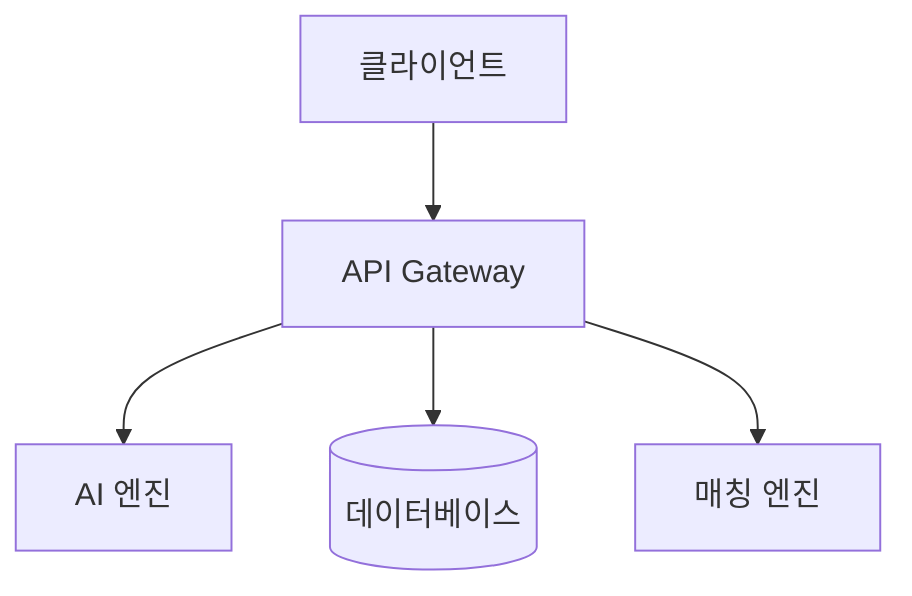

# Mermaid Diagram Support Implementation Plan

> **For agentic workers:** REQUIRED SUB-SKILL: Use superpowers:subagent-driven-development (recommended) or superpowers:executing-plans to implement this plan task-by-task. Steps use checkbox (`- [ ]`) syntax for tracking.

**Goal:** Render ` ```mermaid ` fenced code blocks as clean SVG diagrams instead of raw ASCII art.

**Architecture:** `markdown-it` fence rule intercepts mermaid blocks and emits a `<div class="mermaid-pending">` placeholder. A React `useEffect` in `App.tsx` lazy-imports mermaid, calls `mermaid.render()` for each placeholder, and replaces the node's content with the returned SVG string. `renderMarkdown()` stays synchronous.

**Tech Stack:** `mermaid` ^10.x, `markdown-it` (already installed), React `useEffect`, vitest/jsdom for the unit test.

---

### Task 1: Install mermaid package

**Files:**
- Modify: `package.json`

- [ ] **Step 1: Install mermaid**

```bash
npm install mermaid
```

Expected output: `added N packages` — no errors.

- [ ] **Step 2: Verify it resolved**

```bash
node -e "require('mermaid'); console.log('ok')"
```

Expected: `ok`

- [ ] **Step 3: Commit**

```bash
git add package.json package-lock.json
git commit -m "chore: add mermaid dependency"
```

---

### Task 2: Write failing test for fence rule

**Files:**
- Create: `tests/renderer-core/markdown.test.ts`

- [ ] **Step 1: Create the test file**

```ts
// tests/renderer-core/markdown.test.ts
import { describe, expect, it } from 'vitest';
import { renderMarkdown } from '../../src/renderer-core/markdown';

describe('renderMarkdown — mermaid fence', () => {
  it('mermaid 블록을 mermaid-pending div로 변환한다', () => {
    const input = '```mermaid\ngraph TD\n  A --> B\n```';
    const html = renderMarkdown(input);
    expect(html).toContain('class="mermaid-pending"');
    expect(html).not.toContain('<pre class="hljs">');
  });

  it('mermaid 코드 내 특수문자를 HTML 이스케이프한다', () => {
    const input = '```mermaid\ngraph TD\n  A["<클라이언트>"] --> B\n```';
    const html = renderMarkdown(input);
    expect(html).toContain('&lt;클라이언트&gt;');
  });

  it('textContent로 읽으면 원본 코드가 복원된다', () => {
    // vitest env is jsdom — `document` is available globally
    const input = '```mermaid\ngraph TD\n  A --> B\n```';
    const html = renderMarkdown(input);
    const container = document.createElement('div');
    container.innerHTML = html;
    const node = container.querySelector('.mermaid-pending');
    expect(node).not.toBeNull();
    expect(node!.textContent).toContain('graph TD');
    expect(node!.textContent).toContain('A --> B');
  });

  it('다른 언어 코드 블록은 영향받지 않는다', () => {
    const input = '```ts\nconst x = 1;\n```';
    const html = renderMarkdown(input);
    expect(html).toContain('<pre class="hljs">');
    expect(html).not.toContain('mermaid-pending');
  });
});
```

- [ ] **Step 2: Run test to confirm it fails**

```bash
npm test -- tests/renderer-core/markdown.test.ts
```

Expected: FAIL — `expect(html).toContain('class="mermaid-pending"')` fails because mermaid blocks currently go through highlight.js.

---

### Task 3: Implement fence rule override in markdown.ts

**Files:**
- Modify: `src/renderer-core/markdown.ts`

- [ ] **Step 1: Add fence rule inside `createRenderer()`**

Open `src/renderer-core/markdown.ts`. After the `md.renderer.rules.link_open` block (around line 48) and before the `return md;` on line 55, insert:

```ts
  // Mermaid: intercept fence blocks with lang="mermaid"
  const defaultFence =
    md.renderer.rules.fence ??
    ((tokens, idx, opts, _env, self) => self.renderToken(tokens, idx, opts));

  md.renderer.rules.fence = (tokens, idx, options, env, self) => {
    const token = tokens[idx];
    const lang = token.info.trim().toLowerCase();
    if (lang === 'mermaid') {
      const escaped = token.content
        .replace(/&/g, '&amp;')
        .replace(/</g, '&lt;')
        .replace(/>/g, '&gt;');
      return `<div class="mermaid-pending">${escaped}</div>\n`;
    }
    return defaultFence(tokens, idx, options, env, self);
  };
```

The full `createRenderer()` function after the edit should have this structure:

```ts
function createRenderer(): MarkdownIt {
  const md = new MarkdownIt({ /* existing options */ });

  // existing: link_open rule
  md.renderer.rules.link_open = ...;

  // existing: list_item_open rule
  md.renderer.rules.list_item_open = ...;

  // NEW: mermaid fence rule
  const defaultFence = md.renderer.rules.fence ?? ...;
  md.renderer.rules.fence = ...;

  return md;
}
```

- [ ] **Step 2: Run tests to confirm they pass**

```bash
npm test -- tests/renderer-core/markdown.test.ts
```

Expected: All 4 tests PASS.

- [ ] **Step 3: Run full test suite to check no regressions**

```bash
npm test
```

Expected: All tests PASS.

- [ ] **Step 4: Commit**

```bash
git add src/renderer-core/markdown.ts tests/renderer-core/markdown.test.ts
git commit -m "feat: mermaid fence rule — emit mermaid-pending placeholder"
```

---

### Task 4: Add mermaid rendering useEffect in App.tsx

**Files:**
- Modify: `src/App.tsx`

- [ ] **Step 1: Add the useEffect after the `html` useMemo**

In `src/App.tsx`, find the `html` useMemo block (around line 103–111). Directly after it, insert:

```tsx
  // Mermaid: render .mermaid-pending placeholders to SVG after html updates
  useEffect(() => {
    if (!previewRef.current) return;
    const nodes = Array.from(
      previewRef.current.querySelectorAll<HTMLDivElement>('.mermaid-pending'),
    );
    if (!nodes.length) return;

    let cancelled = false;

    import('mermaid').then(({ default: mermaid }) => {
      if (cancelled) return;
      mermaid.initialize({ startOnLoad: false, securityLevel: 'loose' });

      nodes.forEach(async (node, i) => {
        const code = node.textContent ?? '';
        try {
          const id = `mermaid-${Date.now()}-${i}`;
          const { svg } = await mermaid.render(id, code);
          if (!cancelled) {
            node.innerHTML = svg;
            node.className = 'mermaid-diagram';
          }
        } catch (err) {
          if (!cancelled) {
            node.textContent = `[Mermaid 오류: ${err instanceof Error ? err.message : String(err)}]`;
            node.className = 'mermaid-error';
          }
        }
      });
    });

    return () => {
      cancelled = true;
    };
  }, [html]);
```

- [ ] **Step 2: Typecheck**

```bash
npm run typecheck
```

Expected: no errors.

- [ ] **Step 3: Commit**

```bash
git add src/App.tsx
git commit -m "feat: render mermaid placeholders to SVG via useEffect"
```

---

### Task 5: Add CSS for mermaid states

**Files:**
- Modify: `src/styles/markdown.css`

- [ ] **Step 1: Append mermaid styles to end of file**

Add the following at the very end of `src/styles/markdown.css`:

```css
/* ── Mermaid diagrams ─────────────────────────────────── */
.mermaid-pending {
  margin: 1.2em 0;
  padding: 24px;
  border: 1px dashed var(--border);
  border-radius: var(--radius-md);
  text-align: center;
  color: var(--fg-muted);
  font-size: 0.8em;
  opacity: 0.5;
  white-space: pre;
  font-family: var(--font-mono);
}

.mermaid-diagram {
  margin: 1.2em 0;
  display: flex;
  justify-content: center;
  overflow-x: auto;
}

.mermaid-diagram svg {
  max-width: 100%;
  height: auto;
  border-radius: var(--radius-md);
}

.mermaid-error {
  margin: 1.2em 0;
  padding: 12px 16px;
  background: var(--bg-code);
  border: 1px solid var(--border);
  border-radius: var(--radius-md);
  color: var(--fg-muted);
  font-family: var(--font-mono);
  font-size: 0.85em;
}
```

- [ ] **Step 2: Commit**

```bash
git add src/styles/markdown.css
git commit -m "feat: CSS for mermaid-pending, mermaid-diagram, mermaid-error states"
```

---

### Task 6: Manual verification

- [ ] **Step 1: Start the dev server**

```bash
npm run dev
```

- [ ] **Step 2: Paste this test diagram into the left pane**

````

````

Expected: Right pane shows a clean SVG flowchart with rectangular boxes and arrows. No misaligned ASCII art.

- [ ] **Step 3: Test error handling — paste invalid mermaid**

````
```mermaid
this is not valid mermaid syntax !!!
```
````

Expected: `[Mermaid 오류: ...]` message shown inline. The rest of the document renders normally.

- [ ] **Step 4: Test PNG export with diagram**

Click **PNG** export. Open the saved file.  
Expected: The mermaid SVG diagram appears in the exported image.

- [ ] **Step 5: Final commit if any cleanup needed, then done**

```bash
git add -A
git commit -m "chore: mermaid support cleanup" # only if there are changes
```
